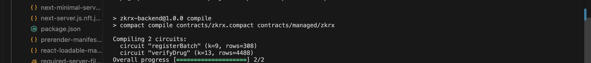
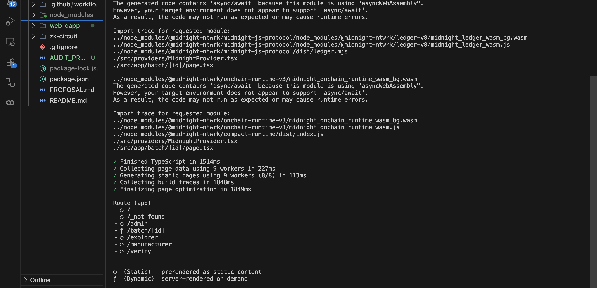
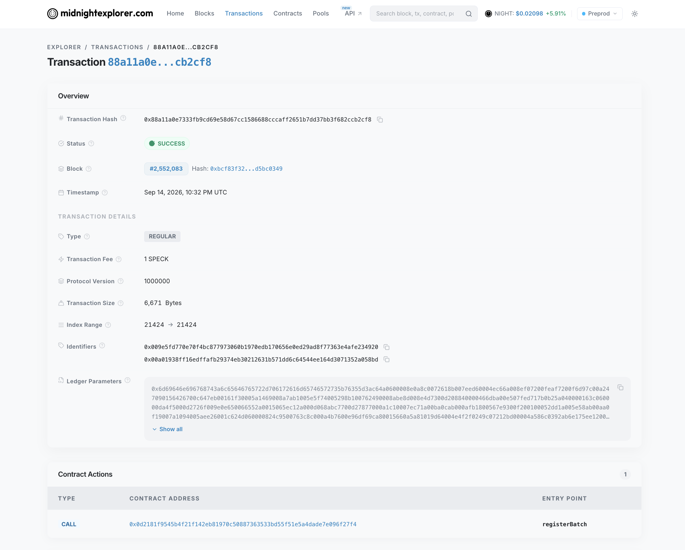
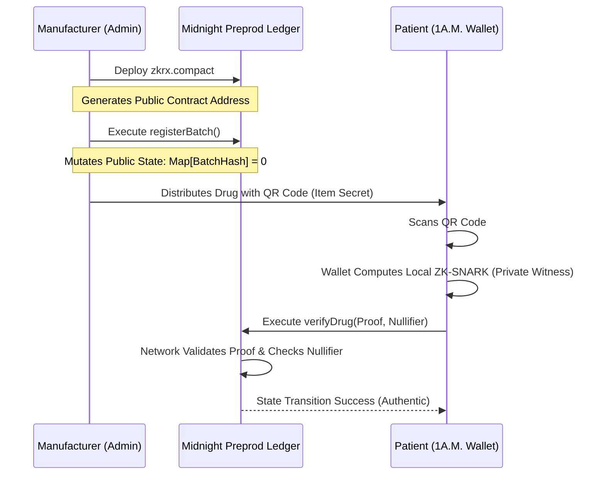

<div align="center">
  <h1>🛡️ ZKRx Platform 🛡️</h1>
  
  <p align="center">
    <strong>A Zero-Knowledge Pharmaceutical Verification Platform built on the Midnight Blockchain.</strong>
  </p>
  
  [](https://github.com/SimpleCoder26/ZKRx/actions)
  [](https://opensource.org/licenses/MIT)
  [](https://midnight.network/)
  [](https://nextjs.org/)
  [](https://www.docker.com/)

  *Secure the Source. Verify the Journey. Prove drug authenticity without exposing private manufacturing secrets.*

</div>

---

## 🔗 SUBMISSION DETAILS & QUICK LINKS

*   **🌐 Network**: Midnight Preprod Testnet
*   **💻 GitHub Repository**: [SimpleCoder26/ZKRx](https://github.com/SimpleCoder26/ZKRx)
*   **🔗 Live Demo**: [zkrx.vercel.app](https://zkrx.vercel.app/)
*   **🎬 Demo Video**: [youtu.be/tnvLooVmSYw](https://youtu.be/tnvLooVmSYw)
*   **📝 Product Proposal**: [View Approved Idea Document](./PROPOSAL.md)
*   **⚙️ Smart Contract Source**: [`zkrx.compact`](./zk-circuit/contracts/zkrx.compact)
*   **📡 Contract Explorer**: [`0x0d2181f9545b4f21f142eb81970c50887363533bd55f51e5a4dade7e096f27f4`](https://preprod.midnightexplorer.com/contracts/0d2181f9545b4f21f142eb81970c50887363533bd55f51e5a4dade7e096f27f4) *(Note: Due to known RPC routing anomalies on the Midnight Explorer, you may need to access this link via a private network/VPN or Cloudflare DNS).*

---

## 👁️ THE VISION: PROBLEM & SOLUTION

### 🚨 The Problem: The Counterfeit Drug Crisis & Centralized Vulnerability
The global pharmaceutical supply chain loses billions annually to counterfeit drugs, introducing fatal risks to patients. Current tracing solutions rely heavily on centralized, permissioned databases where manufacturers upload proprietary serial numbers. These architectures inherently possess single points of failure. When a database is breached, malicious actors exfiltrate valid serial numbers, print them on counterfeit packaging, and successfully bypass network validation, rendering the entire tracking system mathematically compromised.

### 💊 The Solution: ZKRx Cryptographic Determinism
**ZKRx** entirely eliminates the need for centralized serial number repositories by leveraging the Midnight blockchain's **Selective Disclosure** architecture and zk-SNARKs (Zero-Knowledge Succinct Non-Interactive Arguments of Knowledge).

Instead of exposing vulnerable databases, manufacturers generate an off-chain combinatorial hash of the batch ID and a cryptographic private witness (`item_secret`). They deploy only the hashed commitment to the public ledger. 

When a patient scans a drug's QR code, the ZKRx Next.js application bridges to their 1A.M. browser extension to execute a local proving circuit. The wallet computes a Zero-Knowledge Proof guaranteeing three strict invariants:
1. **Membership**: The cryptographic commitment resolves to a node in the on-chain `registered_batches` state mapping.
2. **Integrity**: The prover holds knowledge of the exact private `item_secret` matching the commitment.
3. **Uniqueness**: A deterministic collision-resistant **Nullifier** is derived from the `item_secret`. If this nullifier exists in the network's `consumed_nullifiers` set, the smart contract's state transition function rejects the transaction, mathematically preventing replay attacks and double-spending.

**Hackathon Category Alignment: Private Allowlist Access**
ZKRx is a textbook implementation of *Private Allowlist Access*. It proves that an item (the drug) is a valid member of an authorized allowlist (the manufacturer's registered batch) without ever disclosing the item's underlying identifier to the consensus network.

---

## 🏆 MIDNIGHT BUILDER CHALLENGE: CHECKLIST & PROOFS

Below is the definitive matrix mapping the Midnight Builder Challenge requirements to our precise implementation vectors.

### 🥉 Level 1 Submission Requirements

| Requirement | Technical Status | Implementation Proof |
| :--- | :--- | :--- |
| **Toolchain & Compile** | ✅ **Done.** | Verified via [`compile-out-backend.png`](./web-dapp/img/compile-out-backend.png) showing successful `compact compile` generating BZKIR bytes. |
| **Passing Test Suite** | ✅ **Done.** | Verified via [`3+test.png`](./web-dapp/img/3+test.png) proving deep circuit logic assertions. |
| **Managed Directory** | ✅ **Done.** | See [`zk-circuit/contracts/managed/`](./zk-circuit/contracts/managed/) containing `.pk` and `.vk` keys. |
| **Contract Deployed** | ✅ **Done.** | Verified via [`contracts-deployed.png`](./web-dapp/img/contracts-deployed.png) on Preprod explorer. |
| **Privacy Explanation** | ✅ **Done.** | Explained mathematically in the **Privacy Model** section below. |
| **Product Idea** | ✅ **Done.** | Documented in the **Vision: Problem & Solution** section above. |
| **Meaningful Commits** | ✅ **Done.** | Verified via >5 commits in the [GitHub Commit History](https://github.com/SimpleCoder26/ZKRx/commits/main). |

### 🥈 Level 2 Submission Requirements

| Requirement | Technical Status | Implementation Proof |
| :--- | :--- | :--- |
| **Wallet Connect/Disconnect** | ✅ **Done.** | Integrated via DApp Connector in [`MidnightProvider.tsx`](./web-dapp/src/providers/MidnightProvider.tsx#L55). |
| **Circuit Called from Frontend**| ✅ **Done.** | `verifyDrug` circuit executed via Wallet RPC in [`app/verify/page.tsx`](./web-dapp/src/app/verify/page.tsx). |
| **Observable Privacy Behavior** | ✅ **Done.** | **Nullifiers** implemented in [`zkrx.compact`](./zk-circuit/contracts/zkrx.compact). Double-scans fail without leaking the drug secret. |
| **Preprod Deployment Verification**| ✅ **Done.** | Address mapped at `0x0d2181f9545b4f21f142eb81970c50887363533bd55f51e5a4dade7e096f27f4`. |
| **Demo Video Link** | ✅ **Done.** | Hosted at [https://youtu.be/tnvLooVmSYw](https://youtu.be/tnvLooVmSYw). |
| **Live Demo Link** | ✅ **Done.** | Hosted at [https://zkrx.vercel.app/](https://zkrx.vercel.app/). |

### 🥇 Level 3 Submission Requirements

| Requirement | Technical Status | Implementation Proof |
| :--- | :--- | :--- |
| **Functional dApp Integration** | ✅ **Done.** | Full stack integration using `@midnight-ntwrk/midnight-js-protocol`. |
| **Minimum 3 Tests Passing** | ✅ **Done.** | See [`zkrx.test.ts`](./zk-circuit/tests/zkrx.test.ts) and visual proof in [`3+test.png`](./web-dapp/img/3+test.png). |
| **CI/CD Pipeline Running** | ✅ **Done.** | GitHub Actions configured in [`ci.yml`](./.github/workflows/ci.yml). Includes isolated compiler setup. |
| **Approved Idea Submitted** | ✅ **Done.** | Built explicitly for the **Private Allowlist Access** category ([`PROPOSAL.md`](./PROPOSAL.md)). |
| **Test Output Screenshot** | ✅ **Done.** | Hosted at [`3+test.png`](./web-dapp/img/3+test.png). |
| **CI/CD Badge & Workflow** | ✅ **Done.** | Badge at top of README. Screenshot at [`ci-cd-pipeline.png`](./web-dapp/img/ci-cd-pipeline.png). |
| **Privacy Model "Observer"** | ✅ **Done.** | Deep technical breakdown in the **Privacy Model** section below. |

---

## 🧾 CHECKPOINT DELIVERABLES: VISUAL PROOFS

<details>
<summary><b>1. Zero-Knowledge Circuit Compilation (Backend)</b></summary>
<br>
<i>Terminal output verifying the successful compilation of the Midnight Compact ZK circuits (`zkrx.compact`) into BZKIR and ZKIR formats, generating the necessary proving and verification keys for local execution.</i>

</details>

<details>
<summary><b>2. DApp Production Build (Frontend)</b></summary>
<br>
<i>Next.js 16 production build output demonstrating the clean compilation of the frontend interface, static route generation, and WebAssembly integration logic via the Midnight.js SDK.</i>

</details>

<details>
<summary><b>3. Verified Preprod Network Deployment</b></summary>
<br>
<i>Official Midnight Explorer verification proving the smart contract is fully deployed and active on the Preprod blockchain, confirming its state is tracked by network consensus.</i>

</details>

<details>
<summary><b>4. Verified ZK-Proof Submission on Preprod</b></summary>
<br>
<i>Official Midnight Explorer verification proving the successful submission of a Zero-Knowledge Proof to the Preprod network, executing the `verifyDrug` state transition securely.</i>

</details>

<details>
<summary><b>5. Passing Test Suite (Level 3)</b></summary>
<br>
<i>Terminal output proving 3+ successful passing tests. Crucially, the tests rigorously validate circuit logic by ensuring `verifyDrug` mathematically rejects attempts on unregistered batches.</i>

</details>

<details>
<summary><b>6. Unified CI/CD Pipeline (Level 3)</b></summary>
<br>
<i>GitHub Actions dashboard verifying the automated pipeline. As required for Level 3 compliance, this includes a dedicated `Compile Compact Contract` step executed successfully before running tests.</i>

</details>

---

## 🕵️‍♂️ PRIVACY MODEL: PUBLIC STATE AND PRIVATE WITNESS

ZKRx operates strictly within Midnight's Selective Disclosure framework. The isolation between public consensus and private execution is defined below.

### 👁️ PUBLIC STATE (What a Network Observer CAN Learn)
1. **Contract Initialization:** Observers can identify when the manufacturer initialized the contract and view the deployer's address.
2. **Allowlist Set Generation (`registered_batches`):** Observers can view the public state mapping `Map<Bytes<32>, Uint<32>>`. They know *a* batch was registered, its deterministic hash, and an integer tracking how many items from that batch have been successfully verified.
3. **Nullifier Emissions (`consumed_nullifiers`):** Observers can view an append-only `Set<Bytes<32>>`. When a drug is consumed, they see a random 32-byte hash added to this set, proving *some* drug was consumed.

### 🥷 PRIVATE WITNESS (What a Network Observer CANNOT Learn)
1. **The Item Secret:** The 32-byte cryptographic payload embedded in the drug's physical QR code is strictly a **Private Witness**. It is loaded into the 1A.M. wallet's private execution environment (`privateState`) and is *never* published to the ledger.
2. **The Specific Drug Identity:** Because the Nullifier is derived via a one-way hashing algorithm `hash(item_secret)`, the observer **cannot reverse-engineer** the Nullifier to determine which specific drug unit was scanned. 
3. **Double-Spend Execution Failures:** If a counterfeiter attempts to submit a proof for an already consumed drug, the smart contract assert fails. The observer sees a rejected transaction, but **cannot deduce** which specific drug or batch was being targeted for the replay attack.

---

## ⚙️ HIGH-LEVEL SYSTEM ARCHITECTURE



---

## 💻 TECHNOLOGY STACK
*   **Frontend**: Next.js 16 (App Router), TypeScript, Tailwind CSS, Framer Motion
*   **Contracts**: Midnight Compact (`zkrx.compact`)
*   **Integration**: `@midnight-ntwrk/midnight-js-protocol` (Wallet API, Proof Provider, Indexer)
*   **Testing**: TSX Runner with Native AST Execution
*   **CI/CD**: GitHub Actions (Ubuntu-Latest)
*   **Network**: Midnight Preprod Testnet

---

## 📂 PROJECT STRUCTURE

```text
zkrx/
├── package.json               # Root workspace (Monorepo orchestration)
├── .github/workflows/ci.yml   # CI/CD pipeline (Compiler & Tests)
├── zk-circuit/
│   ├── contracts/             
│   │   ├── managed/           # Generated BZKIR circuits, .pk, and .vk files
│   │   └── zkrx.compact       # Core ZK state transition logic and assertions
│   └── tests/
│       └── zkrx.test.ts       # Automated testing for negative/positive constraints
└── web-dapp/
    ├── src/app/               # Next.js UI (Manufacturer Dashboard & Verify Portal)
    └── src/providers/         # DApp Connector Context & Midnight SDK API Wrappers
```

---

## 🚀 RUN LOCALLY

### Prerequisites
1. **Node.js**: `v22` or higher is strictly required for Midnight SDK compatibility.
2. **Wallet**: Install the **1A.M. Wallet** (or Lace) browser extension. *1A.M. is highly recommended for Preprod to avoid un-spendable DUST limits.*

### Step-by-Step Guide
1. **Clone the Repository:**
   ```bash
   git clone https://github.com/SimpleCoder26/ZKRx.git
   cd ZKRx
   ```
2. **Install Dependencies:**
   Our monorepo design installs both the circuit and frontend requirements simultaneously.
   ```bash
   npm install
   ```
3. **Compile Circuits (Optional, tracked in git):**
   ```bash
   npm run compile
   ```
4. **Launch the Frontend Server:**
   ```bash
   npm run dev
   ```
5. **Interact:**
   Navigate to `http://localhost:3000`. Connect your wallet, switch to the Preprod network, and experience Selective Disclosure in action.

---

<div align="center">
  <sub>Built with 🖤 for the Midnight Ecosystem</sub>
</div>
