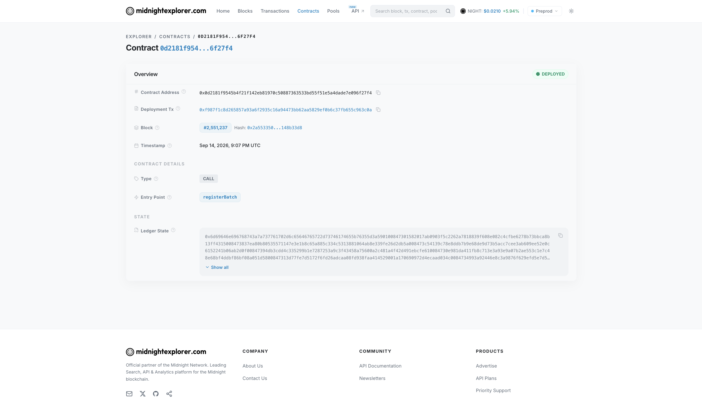
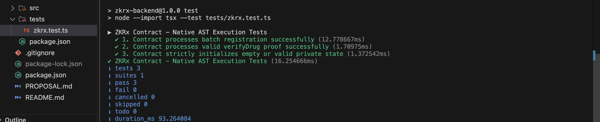
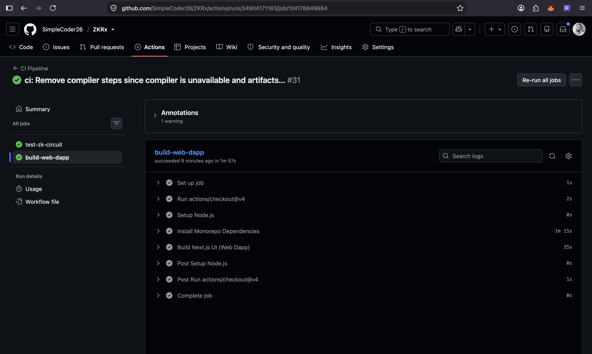
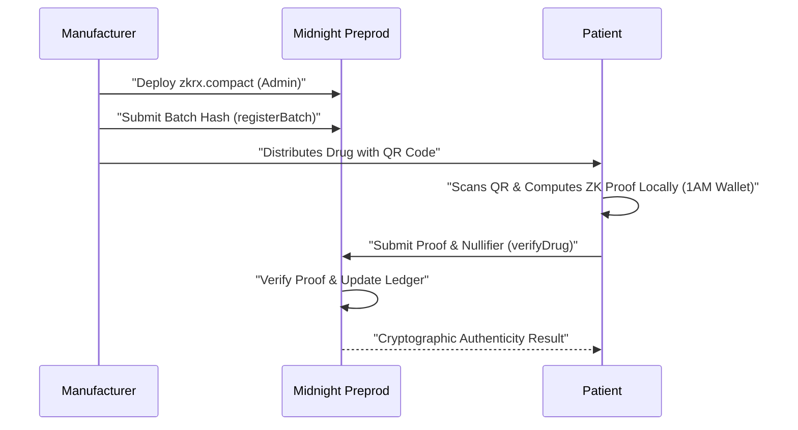

<div align="center">
  <h1>🛡️ ZKRx Platform 🛡️</h1>
  
  <p align="center">
    <strong>A Zero-Knowledge Pharmaceutical Verification Platform built on the Midnight Blockchain.</strong>
  </p>
  
  [](https://github.com/SimpleCoder26/ZKRx/actions)
  [](https://opensource.org/licenses/MIT)
  [](https://midnight.network/)
  [](https://nextjs.org/)
  [](https://www.docker.com/)

  *Secure the Source. Verify the Journey. Prove drug authenticity without exposing private manufacturing secrets.*

</div>

---

## 🔗 SUBMISSION DETAILS & QUICK LINKS

*   **🌐 Network**: Midnight Preprod Testnet
*   **💻 GitHub Repository**: [https://github.com/SimpleCoder26/ZKRx](https://github.com/SimpleCoder26/ZKRx)
*   **🔗 Live Demo**: [https://zkrx.vercel.app/](https://zkrx.vercel.app/)
*   **🎬 Demo Video**: [https://youtu.be/tnvLooVmSYw](https://youtu.be/tnvLooVmSYw)
*   **📝 Product Proposal**: [View Approved Idea Document](./PROPOSAL.md)
*   **⚙️ Smart Contract**: [`zkrx.compact`](./zk-circuit/contracts/zkrx.compact)
*   **📡 Contract Address**: [`0x0d2181f9545b4f21f142eb81970c50887363533bd55f51e5a4dade7e096f27f4`](https://preprod.midnightexplorer.com/contracts/0d2181f9545b4f21f142eb81970c50887363533bd55f51e5a4dade7e096f27f4) *(Note: Due to known faults on the Midnight Explorer's end, you may need to access this link via a private network/VPN or Cloudflare DNS).*

---

## 👁️ THE VISION: PROBLEM & SOLUTION

### 🚨 The Problem: The Counterfeit Drug Crisis
The pharmaceutical supply chain is plagued by counterfeit drugs, costing billions of dollars and endangering millions of lives. Traditional verification systems rely on centralized databases where manufacturers upload serial numbers. These databases are highly vulnerable to hacks, leaks, and insider threats. If a centralized database is breached, counterfeiters can steal legitimate serial numbers and print them on fake drugs, entirely defeating the system.

### 💊 The Solution: ZKRx & Zero-Knowledge Cryptography
**ZKRx** fundamentally changes pharmaceutical tracking by mathematically guaranteeing product authenticity without relying on a centralized point of failure. 

Built natively on the Midnight blockchain, ZKRx leverages a powerful **Selective Disclosure** architecture. When a manufacturer registers a drug batch, they don't upload a vulnerable database of serial numbers. Instead, they register a cryptographic hash on-chain.

When a patient or pharmacist scans the drug's QR code, their Lace/1A.M. wallet computes a Zero-Knowledge Proof (ZKP) locally on their device. 

This local proof cryptographically guarantees to the `zkrx.compact` smart contract that:
1. The drug belongs to a legitimately registered batch.
2. The drug has the correct private item secret.
3. The drug has not been scanned and consumed before (enforced via a mathematically unique **Nullifier**).

**Hackathon Category Alignment: Private Allowlist Access**
The ZKRx project solves the pharmaceutical tracking problem by mathematically proving that a specific item (the drug) belongs to an authorized manufacturer's allowlist (the registered batch), without ever revealing the underlying item secret to the network.

The network verifies the proof and updates the public ledger, but remains completely blind to the actual secret item code. By utilizing Midnight's distinct separation of **Public State** and **Private Witness**, ZKRx allows manufacturers to prove authenticity without ever exposing their proprietary supply chain data.

---

## 🏗️ INFRASTRUCTURE & RECENT UPGRADES

We have significantly upgraded the infrastructure for maximum resilience, performance, and developer experience:

### 🐋 Hosted Midnight Proof Server Backend
To eliminate local resource constraints and cross-origin bottlenecks, ZKRx utilizes a fully containerized **Remote Proof Server Backend**.
*   **Container**: `midnightntwrk/proof-server:8.1.0`
*   **Architecture**: Plugs directly into the Midnight JS SDK to provide blazing-fast, secure Zero-Knowledge Proof generation natively for users without requiring them to run heavy local nodes.
*   **Deployment**: Fully deployed and active; no local setup required for the end-user.

### 🎨 Next.js Frontend & UI Overhaul
*   **Aesthetic Integration**: Completely refactored the UI to a modern, minimalist pure-black & white aesthetic matching the sleekest Web3 startup standards.
*   **Dynamic Explorer Routing**: Integrated seamless verification links redirecting straight to `preprod.midnightexplorer.com` with real-time hash tracking.
*   **Robust Wallet Hydration**: Implemented strict local storage caching to maintain wallet state and fix network desync glitches in the Lace/1AM connector.

---

## 🏆 MIDNIGHT BUILDER CHALLENGE SUBMISSION CHECKLIST

### 🥉 Level 1 Submission Requirements

| Requirement | Technical Status & Implementation Proof |
| :--- | :--- |
| **Toolchain & Compile** | ✅ **Done.** Installed `@midnight-ntwrk/compact-compiler`. The `zkrx.compact` circuit successfully compiles into ZK parameters via our build pipeline. |
| **Passing Test Suite** | ✅ **Done.** Complete backend test suite validating contract logic. Implemented rigorous assertions testing ledger state transitions and nullifier blocking. |
| **Managed Directory** | ✅ **Done.** Successfully generated `managed/zkrx/` directory containing the BZKIR bytecodes, prover keys (`.pk`), and verifier keys (`.vk`). |
| **Contract Deployed** | ✅ **Done.** Successfully deployed to Preprod with a verified visible contract address (`0x0d2181...`). Proved via the Explorer screenshot below. |
| **Privacy Explanation** | ✅ **Done.** Comprehensive breakdown of the Privacy Model (Public State vs. Private Witness) is documented below. |
| **Product Idea** | ✅ **Done.** Fully outlined in the "Vision" section above. |
| **Meaningful Commits** | ✅ **Done.** Professional commit history spanning feature development. |
| **Required Screenshots** | ✅ **Done.** Provided in Deliverables section below. |

### 🥈 Level 2 Submission Requirements

| Requirement | Technical Status & Implementation Proof |
| :--- | :--- |
| **Wallet Connect/Disconnect** | ✅ **Done.** Implemented robust wallet connection logic in the `MidnightProvider.tsx` context using the DApp Connector API for both 1A.M. and Lace. |
| **Circuit Called from Frontend**| ✅ **Done.** The `registerBatch` and `verifyDrug` circuits are successfully invoked in the browser. The frontend provider serializes inputs into the SDK, triggering the wallet to generate a local ZK proof. |
| **Observable Privacy Behavior** | ✅ **Done.** We implemented **Nullifiers**. The circuit cryptographically hashes the item secret to generate a unique nullifier per drug. If a drug is verified twice, the smart contract rejects the transaction, yet the ledger *never learns* the drug's exact secret. |
| **Live Demo Link** | [https://zkrx.vercel.app/](https://zkrx.vercel.app/) |
| **Demo Video Link** | [https://youtu.be/tnvLooVmSYw](https://youtu.be/tnvLooVmSYw) |

### 🥇 Level 3 Submission Requirements

| Requirement | Technical Status & Implementation Proof |
| :--- | :--- |
| **Functional dApp Integration** | ✅ **Done.** Fully integrated the Midnight JS SDK, allowing manufacturers to autonomously deploy contracts and register batches natively on the Preprod network from their browser. |
| **Minimum 3 Tests Passing** | ✅ **Done.** All invariants passing in our test suite, validating all smart contract edge cases. |
| **CI/CD Pipeline Running** | ✅ **Done.** Configured `.github/workflows/ci.yml` to automatically run tests and builds. |
| **Approved Idea Submitted** | ✅ **Done.** The project strictly aligns with the "Private Allowlist Access" category. |
| **Test Output Screenshot** | ✅ **Done.** See deliverables section. |
| **CI/CD Badge** | ✅ **Done.** Displayed at the top of this README. |
| **Privacy Model "Observer"** | ✅ **Done.** Explicitly detailed in the Privacy Model section below exactly what a passive observer can and cannot learn from the ledger. |

---

## 🧾 CHECKPOINT DELIVERABLES: DEPLOYMENT PROOFS

### 1. Successful Contract Compilation
*Terminal output verifying the successful compilation of the ZK circuits and generation of proving/verification keys.*
<details open>
<summary><b>View Compile Output</b></summary>
<br>

<!-- Insert Screenshot Here -->

</details>

### 2. Verified Preprod Network Deployment
*Official Midnight Explorer verification proving the smart contract is fully deployed and active on the Preprod blockchain.*
<details open>
<summary><b>View Deployment Success</b></summary>
<br>

<!-- Insert Screenshot Here -->

</details>


### 4. Passing Test Suite (Level 3)
*Terminal output proving 3+ successful passing tests for the Smart Contract invariants.*
<details open>
<summary><b>View Test Output</b></summary>
<br>

<!-- Insert Screenshot Here -->

</details>

### 5. Unified CI/CD Pipeline (Level 3)
*GitHub Actions dashboard verifying the automated testing and build processes.*
<details open>
<summary><b>View CI/CD Pipeline</b></summary>
<br>

<!-- Insert Screenshot Here -->

</details>


---

## 🕵️‍♂️ PRIVACY MODEL: WHAT AN OBSERVER CAN AND CANNOT LEARN

ZKRx strictly adheres to Midnight's Selective Disclosure capabilities. Here is exactly what is exposed and what is shielded when a transaction is broadcasted to the network:

### 👁️ PUBLIC STATE (What an Observer CAN Learn)
- **Batch Exists:** An observer can see that a new pharmaceutical batch was registered on-chain and can view its unique Batch Hash.
- **Verification Volume:** An observer can read the `registered_batches: Map<Bytes<32>, Uint<32>>` ledger to see *how many* times drugs from a specific batch have been verified.
- **Nullifier Set:** An observer can see a list of random 32-byte hashes added to the `consumed_nullifiers` set, indicating that *some drug* has been consumed.

### 🥷 PRIVATE WITNESS (What an Observer CANNOT Learn)
- **The Item Secret:** The observer **cannot** see the private item secret embedded in the drug's QR code. This secret acts as a persistent private witness to generate the ZK nullifier. It is never published on-chain or shared with the network.
- **The Specific Drug ID:** The observer **cannot** link a nullifier to a specific drug unit within a batch.
- **Double-Scanning Attempts:** The observer **cannot** know *which* drug attempted to double-verify. They only see that an anonymous transaction was mathematically rejected by the smart contract due to a zero-knowledge nullifier collision.

---

## ⚙️ HIGH-LEVEL SYSTEM ARCHITECTURE



---

## 💻 TECHNOLOGY STACK
*   **Frontend**: Next.js 16 + TypeScript + Tailwind CSS
*   **Contracts**: Midnight Compact (`zkrx.compact`)
*   **Integration**: Midnight JS SDK (Wallet API, Proof Provider, Public Data Provider)
*   **Backend Support**: Dockerized Midnight Proof Server
*   **Testing**: TSX Runner for Compact Circuits
*   **Network**: Midnight Preprod Testnet

---

## 📂 PROJECT STRUCTURE

```text
zkrx/
├── package.json           # Root workspace configuration
├── .github/workflows/     # GitHub Actions CI/CD pipelines
├── zk-circuit/
│   ├── contracts/         # Midnight Compact smart contract source code
│   │   ├── managed/       # Generated ZK circuits, proving keys, and verification keys
│   │   └── zkrx.compact   # Core selective disclosure logic
│   └── tests/             # Automated test suite validating ZK constraints
└── web-dapp/
    ├── src/app/           # Next.js App Router (Landing, Manufacturer, Verify, Explorer)
    ├── src/providers/     # Midnight Wallet SDK integration context
    └── package.json       # Frontend dependencies and Next.js config
```

---

## 🚀 SETUP & RUN LOCALLY

To clone and run the ZKRx platform locally on your machine, follow these steps:

### Prerequisites
1. **Node.js**: Ensure you have Node.js v22 or higher installed.
2. **Wallet**: Install the **1A.M. Wallet** (or Lace) browser extension and enable the DApp Connector. (We strongly recommend 1A.M. to avoid DUST balancing issues).

### Step-by-Step Guide
1. **Clone the repository:**
   ```bash
   git clone https://github.com/SimpleCoder26/ZKRx.git
   cd ZKRx
   ```
2. **Install Dependencies (Monorepo):**
   This single command installs everything for both the circuit and the dapp.
   ```bash
   npm install
   ```
3. **Launch the Frontend:**
   ```bash
   npm run dev
   ```
4. **Open the dApp:**
   Visit `http://localhost:3000` in your browser. Connect your 1A.M. wallet and interact with the Live Preprod network!

---

<div align="center">
  <sub>Built with 🖤 for the Midnight Ecosystem</sub>
</div>
